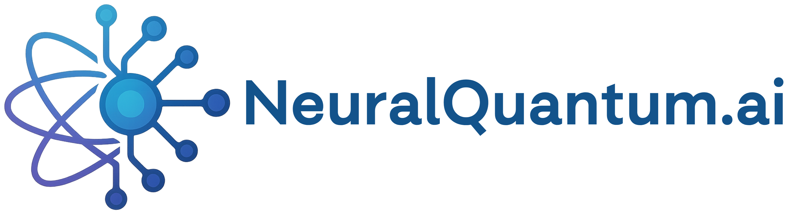

  

# NeuralQuantum.ai

**Unlocking Intelligence at Quantum Speed**

[NeuralQuantum.ai](https://neuralquantum.ai) is an R&D-driven technology company pioneering the convergence of **artificial intelligence** and **quantum computing**. We specialize in developing domain-optimized large language models (LLMs), quantum-aware algorithms, and tools to empower scientists, engineers, and innovators solving the world’s hardest problems.

---

## 🚀 What We Do

- 🧠 **LLM Development** — Quantum-native & physics-informed foundation models  
- 🧪 **Scientific Research** — Open-source tools for applied quantum + AI  
- ⚙️ **Tooling & Benchmarks** — Frameworks for dataset curation and quantum-enhanced model evaluation  
- 🧭 **Consulting Services** — Strategic R&D guidance for next-gen computing and intelligent systems  

---

## 🌌 Featured Projects

| Project | Description |
|--------|-------------|
| **[`nqlm-base`](https://huggingface.co/NeuralQuantum/nqlm-base)** | Base model of our Neural Quantum Language Model series |
| **QSimLLM** | LLM-powered quantum simulator for research and education |
| **QBench** | Evaluation suite for benchmarking quantum-enhanced machine learning |
| **NQLM-Finetune-Toolkit** | Tools and scripts for instruction-tuning domain-specific scientific models |

---

## 🤝 Join the Quantum-AI Frontier

We welcome open-source collaborators, research partners, and developers eager to explore AI × Quantum synergies.

- 🌐 **Website**: [https://neuralquantum.ai](https://neuralquantum.ai)  
- 🧠 **Hugging Face**: [huggingface.co/NeuralQuantum](https://huggingface.co/NeuralQuantum)  
- 💼 **LinkedIn**: [linkedin.com/company/neuralquantumai](https://linkedin.com/company/neuralquantumai)  
- 💬 **Contact**: hello@neuralquantum.ai

---

> “Quantum intelligence isn’t just the future—it’s the foundation.”

📍 Based in innovation hubs worldwide 🌍
